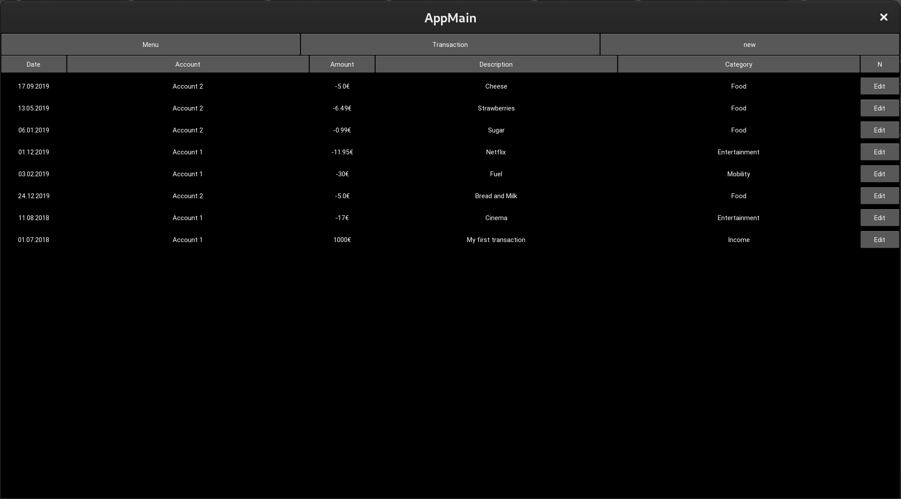
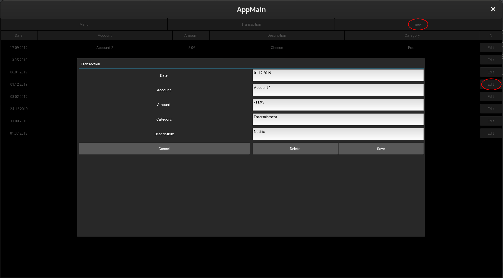
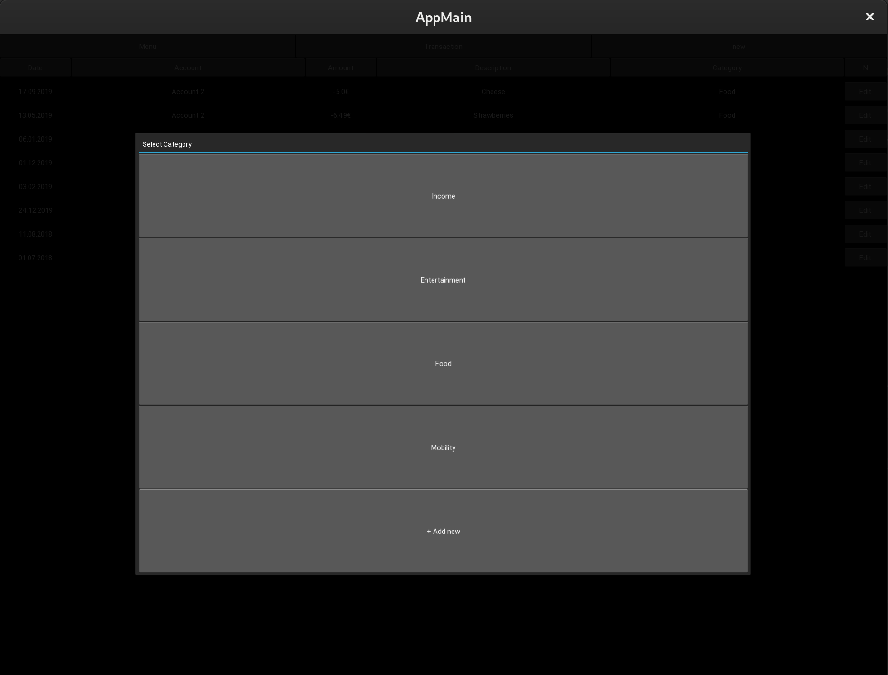
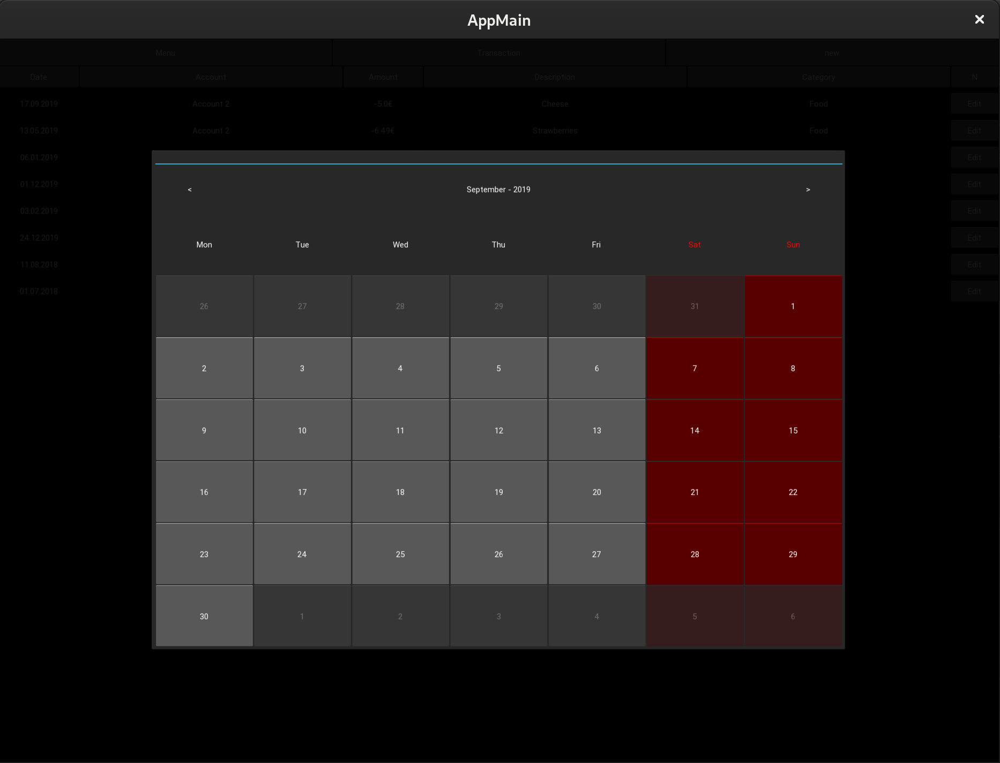
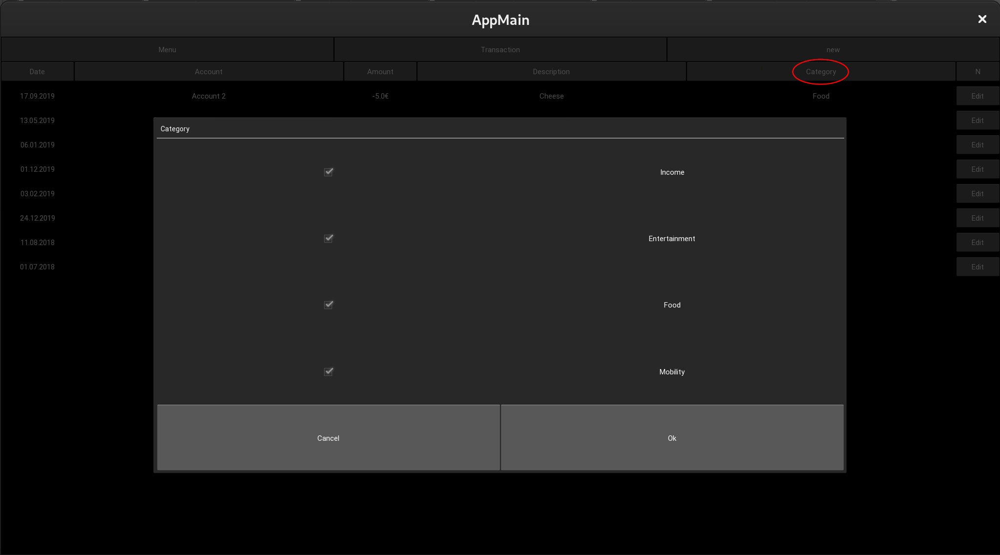
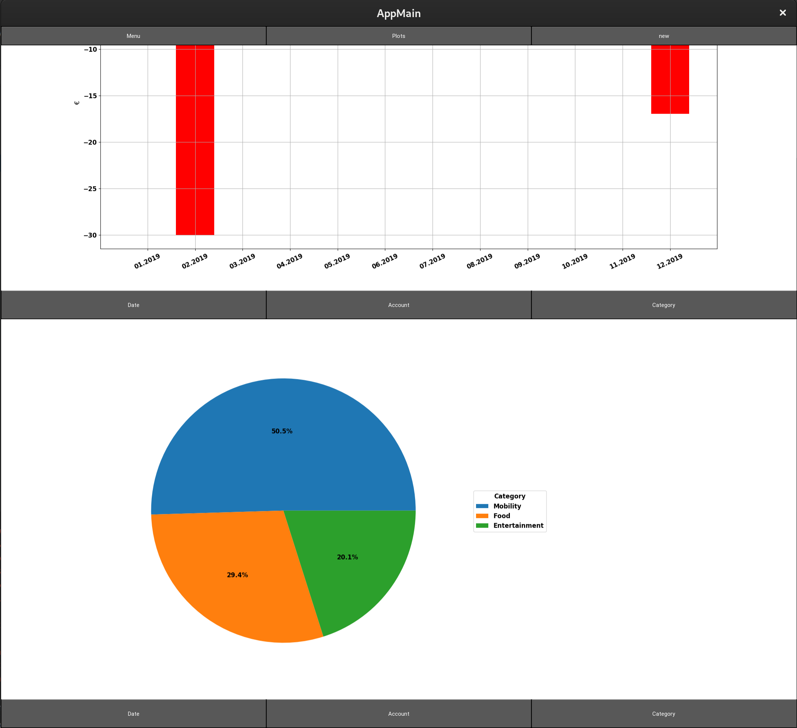

# Finance Manager
This repository started as my personal playground to learn some python.
It evolved into a very basic personal finance / transaction manager.

### App screenshots
Here are some screenshots:
The main view is an overview of all your transactions. I created only a view dummy transactions but the view 
becomes scrollable if you add more.

All the light grey areas are functional buttons for e.g. adding or editing transactions:

To ensure database integrity most of the fields are not free text but open a new view to e.g. select an existing
category/account (or intentionally adding a new category/account):

or selecting a date:

The buttons which represent the column headings of the transaction list can be used for
filtering the displayed transactions list:

The button in the top middle which is displaying the current view can be clicked to switch to the plot view. 
The plot view shows a scrollable list of different plot types. 
You can use the buttons below each plot to filter for the Information which the plot shall display.

### Setup
#### Installing Instructions for developing with PyCharm

* Get repository from Github
* In project tree mark the main folder (TransactionBook) as the projects source directory 
(Right click -> "Mark Directory as" -> "Sources Root").

#### Install required packages (Linux commands)
* sudo pip3 install pandas
* Repeat the above command for [matplotlib, numpy, nose, ]
* sudo pip3 install kivy-garden
* garden install matplotlib
* sudo dnf install xclip xsel